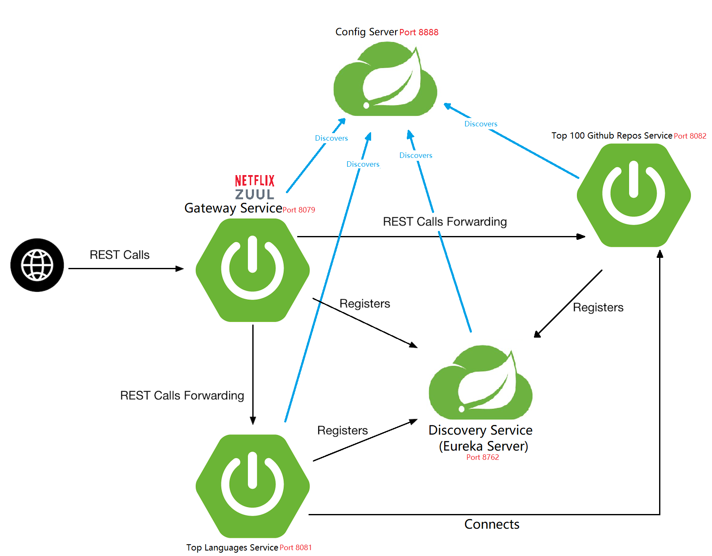

# UnitedRemote-BackendChallenge

REST microservice that list the languages used by the 100 trending public repos on GitHub

## 1. Microservices Architecture
<p align="center">
  
</p>

### Description:
* Top 100 Github Repos Service (Running on port 8082):

    Using this microservice app, we can get top 100 github repositories by given stars. We use Github Search API to achieve this.
    
* Top languages Service (Running on port 8081):

    This microservice app, connect with the service above, so that we can get top languages among the top 100 github repositories. 
    The languages are in descending order, the higher the language is, the more it is popular.
    
    Each language has the number of repos (among the 100 repos) using that language, and a link to those repositories (more on this below)

* Discover Service (Running on port 8762):

    Using **Spring Cloud Netflix Eureka**, we implement this microservice app that allows services to find and communicate with each other without hard-coding hostname and port, instead we are accessing the services with their names.

* Gateway Service (Running on port 8079):

    Using **Spring Cloud Netflix Zuul**, we implement this microservice app that handles all the requests and does the dynamic routing of microservice apps.
    
* Gateway Service (Running on port 8888):

    Using **Spring Cloud Config Server**, we implement this microservice app that provides resource-based API for external configuration (name-value pairs or equivalent YAML content). In here, we have all configurations for each service, and also common configurations shared among the services.

## 2. Run the apps

Before running make sure that the ports in the image above are not in use.
We start the apps in this order:
  
   1. Config Server: running on port 8888
   2. Discover service: running on port 8762
   3. Gateway Service: running on port 8079
   4. Top100GithubRepos Service: running on port 8082
   5. TopLanguages Service: running on port 8081
   

## 3. Test REST API

Since we're using ZUUL as the gateway server, we only gonna use its root URL, that will reach to other services

    localhost:8079
    
**3.1 Get the Top 100 Github repositories**

  We're using Github Search API, to get top 100 github repositories by given stars, in descending order, in JSON format. Here's the method to achieve this.
  
```java
//Customizable github link to get JSON response of top 100 repositories sorted with earned stars in a descending order
public String githubSearchApiLink(int theStars,int thePage) {
	return "https://api.github.com/search/repositories?q=stars:>="+thePage+"&sort=stars&order=desc&page="+thePage+"&per_page=100";
}
```
The repositories we get by Github Search API can have a NULL language, meaning there's no language associated to the repository, so we're filtering the repositories after getting them from the API.

* **URL**

      repos/trending/top100repos

* **Method:**
  
  `GET`

* **Success Response:**

  * **Code:** 200 <br />
    **Content:** 
    ```json
    {
       "items": [
            {
                "name": "Repository Name",
                "description":"Repository description",
                "language": "Repository's language",
                "html_url": "Link to the repository",
                "stars": 308429
            }
       ]
    }
**3.2 Get Top Languages**

Among the top 100 github repos, we get the used languages in descending order, in JSON format. The first language cooresponds to the most popular one, the 2nd language corresponds to the 2nd popular language; and so on.
  

* **URL**

      /github/trending/languages

* **Method:**
  
  `GET`

* **Success Response:**

  * **Code:** 200 <br />
    **Content:**
    ```json
    {
    "ranksCount": "Total of ranks",
    "trendingLanguages": [
        {
            "name": "Language Name",
            "stars": "Total earned stars",
            "numberOfRepos": "Number of repos using this language",
            "links": [
                {
                    "rel": "self",
                    "href": "Link to this language in JSON format"
                },
                {
                    "rel": "repositories",
                    "href": "Link to the repositories among the top 100 that we found in JSON format"
                }
            ]
        }
    ]
    } 
**3.3 Get Language with specified rank**

the request above, return a pair/value "ranksCount", that describes how many languages do we have (or how many ranks there are).

* **URL**

      /github/trending/languages/{rankId}

* **Method:**
  
  `GET`

* **Success Response:**

  * **Code:** 200 <br />
    **Content:**
    ```json
    {
        "name": "Language name",
        "stars": "Total earned stars",
        "numberOfRepos": "Number of repositories using this language",
        "_links": {
            "self": [
                {
                    "href": "Link to this language in JSON format"
                },
                {
                    "href": "Link to the repositories among the top 100 that we found in JSON format"
                }
            ]
        }
    }```
* **Error Handling:**

If {rankId} exceeds the total ranks we have, we get the following response:

  * **Code:** 404 <br />
      **Content:**
      ```json
      {
        "status": 404,
        "message": "Rank not found - {rankId}",
        "timeStamp": "Time stamp"
      }```

If {rankId} has some characters, we get the following response:

  * **Code:** 400 <br />
      **Content:**
      ```json
      {
          "status": 400,
          "message": "Unrecognized endpoint",
          "timeStamp": "Time stamp"
      }```

**3.4 Get repositories of a language with {rankId}**

Getting the repositories using the language of rank {rankId}

* **URL**

      /github/trending/languages/{rankId}/repositories

* **Method:**
  
  `GET`

* **Success Response:**

  * **Code:** 200 <br />
    **Content:**
    ```
    {
      "reposCount": "Number of repos",
      "repositories": [
          {
            "name": "Repository's name",
            "description": "Repository's description",
            "html_url": "Link to repository",
            "links": [
                {
                    "rel": "self",
                    "href": "Link to this repository in JSON format"
                },
                {
                    "rel": "language",
                    "href": "Link to this repository's language in JSON format"
                }
            ]
          }
    }
    ```
**3.5 Get a specified repository**

We can get a specified repository among all repositories of a language with {rankId}

* **URL**

      /github/trending/languages/{rankId}/repositories/{reposId}

* **Method:**
  
  `GET`

* **Success Response:**

  * **Code:** 200 <br />
    **Content:**
    ```
    {
      "name": "Repository's name",
      "description": "Repository's description",
      "html_url": "Repository's link",
      "_links": {
          "self": {
              "href": "Link to this repository"
          },
          "language": {
              "href": "Link to this repository's language"
          }
      }
    }
    ```
* **Error Handling:**

If {reposId} exceeds the total number of repositories we have, we get the following response:

  * **Code:** 404 <br />
      **Content:**
      ```json
      {
        "status": 404,
        "message": "Repository not found - {reposId}",
        "timeStamp": 1580656798039
     }```

If {reposId} has some characters, we get the following response:

  * **Code:** 400 <br />
      **Content:**
      ```json
      {
        "status": 400,
        "message": "Unrecognized endpoint",
        "timeStamp": 1580656890422
      }
      ```
## 3. Sho
    

   
   
   
   
